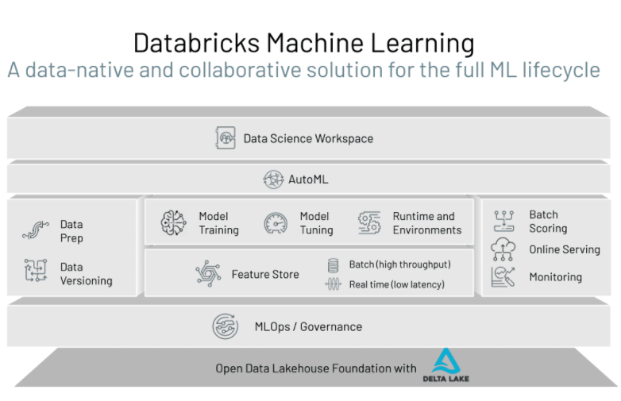

### Databricks ML for the End-to-end ML Lifecycle
Databricks ML is a data-native and collaborative solution for the full ML lifecycle. Whether a data practitioner is exploring or developing features to include in a machine learning model, scaling the training of many models, or deploying a model following a CI/CD process, Databricks ML is exactly where they need to be.

