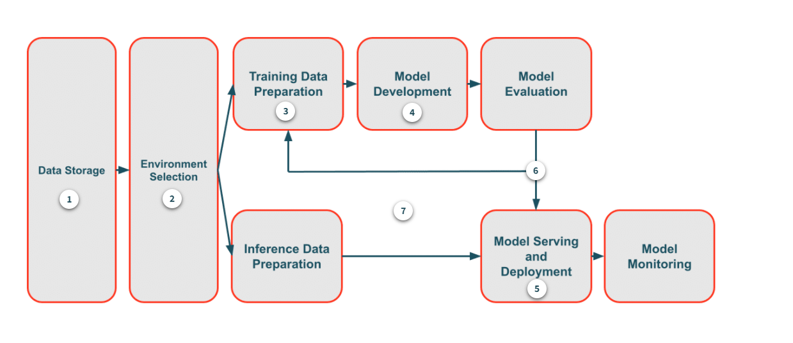
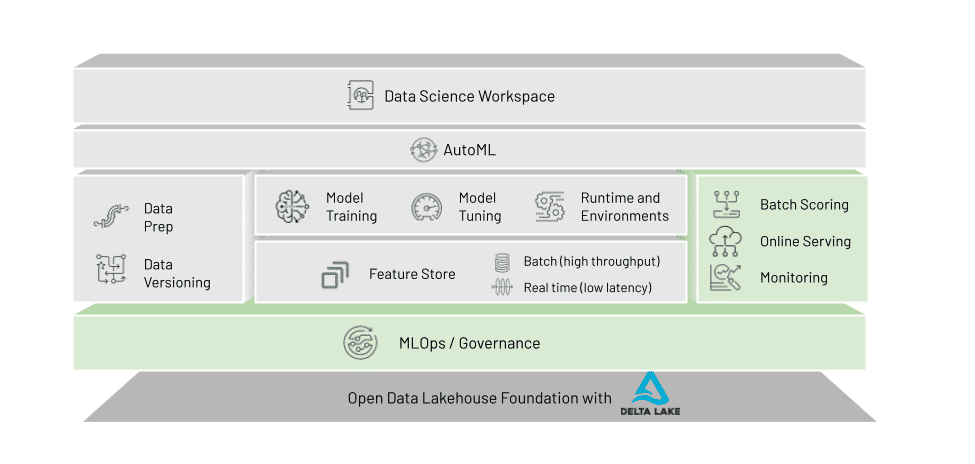

### Databricks ML for the End-to-end ML Lifecycle
Databricks ML is a data-native and collaborative solution for the full ML lifecycle. Whether a data practitioner is exploring or developing features to include in a machine learning model, scaling the training of many models, or deploying a model following a CI/CD process, Databricks ML is exactly where they need to be.

### Common Machine Learning Problems

1. Data Storage: Data quality issues are commonplace in machine learning applications. When data and machine learning work occur in different platforms, there's always going to be an opportunit for data to become lost, corrupted or miss out on vital cleaning tasks.

2. Computer Resources: Data parctitioners frequently struggle with computer resources. They might be ineffciently allocating more cloud recousers than needed, or they could be struggling to scale with limited on-premises servers. These problems can cost organizations in finances and time.

3. Freature Development: When solving data science problems, practitioners need to create their input datasets. The domain knowledge and engineering prowess necessary to do this requires time to develop and apply, so this can freqeuntly be one of th most time-consuming parts of the machine learning lifecycly. In addition, this creates many opportunitites of practitioners to accidentally miscalculate a feature value.

### DataBricks ML Solutions

### MLflow Overview
MLflow is one of the major components of performing machine learning on Databricks. It's an open source tool developed within Databricsk for managing the entire machine learning lifecycle. 

### AutoML
Databricks AutoML helps practitioners automatically apply machine learning to a dataset. It utilizes popular open-source machine learning libraries to build the models.